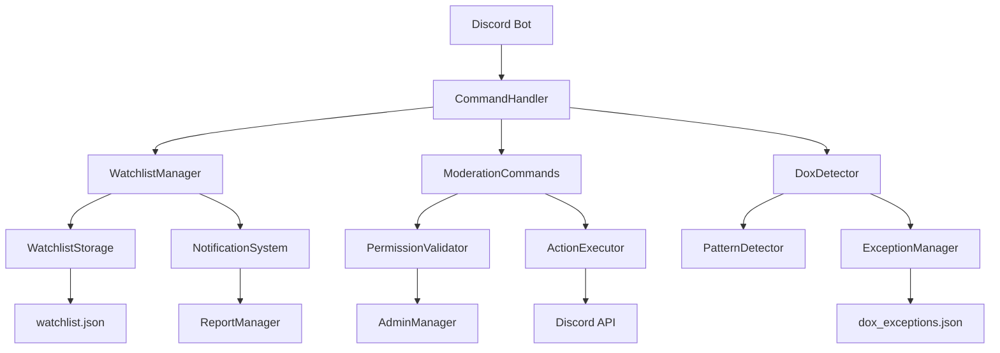

# Design Document

## Overview

Cette conception détaille l'amélioration du système de surveillance (WatchlistManager) et l'ajout de commandes de modération complètes pour le bot Discord. Le système intégrera une surveillance robuste des utilisateurs problématiques avec des outils de modération respectant la hiérarchie des permissions Discord, ainsi qu'une modification du système antidox pour exclure les IDs Discord des détections de données sensibles.

## Architecture

### System Components



### Core Architecture Principles

1. **Separation of Concerns**: Chaque composant a une responsabilité spécifique
2. **Permission-Based Access**: Toutes les actions respectent la hiérarchie Discord
3. **Event-Driven Notifications**: Système de notifications automatiques
4. **Data Persistence**: Stockage fiable avec gestion d'erreurs
5. **Extensible Design**: Architecture permettant l'ajout facile de nouvelles fonctionnalités

## Components and Interfaces

### 1. Enhanced WatchlistManager

#### Interface
```javascript
class WatchlistManager {
    // Core CRUD operations
    addToWatchlist(userId, reason, moderatorId, guildId, options)
    removeFromWatchlist(userId, guildId)
    getWatchlistEntry(userId, guildId)
    
    // Global watchlist operations
    addToGlobalWatchlist(userId, reason, moderatorId, options)
    removeFromGlobalWatchlist(userId)
    getGlobalWatchlistEntry(userId)
    
    // Monitoring and notifications
    handleUserJoin(member)
    handleUserMessage(message)
    handleUserAction(userId, guildId, action, actionData)
    
    // Management operations
    addNote(userId, guildId, note, moderatorId)
    addIncident(userId, guildId, incidentData)
    getStats(guildId)
    
    // System operations
    reload()
    validateEntryData(entryData)
    notifyModerators(guildId, userId, eventType, eventData)
}
```

#### Key Improvements
- **Error Handling**: Gestion robuste des erreurs avec retry logic
- **Data Validation**: Validation stricte des données d'entrée
- **Performance**: Optimisation des opérations de recherche
- **Notifications**: Système de notifications amélioré
- **Logging**: Logging détaillé pour le debugging

### 2. Moderation Commands System

#### Command Structure
```javascript
// Base moderation command interface
class ModerationCommand {
    data: SlashCommandBuilder
    requiredPermissions: PermissionsBitField[]
    adminOverride: boolean
    
    async execute(interaction, adminManager, ...managers)
    validatePermissions(interaction, targetUser)
    logAction(action, moderator, target, reason)
}
```

#### Commands to Implement
1. **kick** - Expulser un utilisateur
2. **ban** - Bannir un utilisateur
3. **unban** - Débannir un utilisateur
4. **timeout** - Mettre en timeout
5. **clear** - Supprimer des messages
6. **watchlist-add** - Ajouter à la surveillance
7. **watchlist-remove** - Retirer de la surveillance
8. **watchlist-list** - Lister les utilisateurs surveillés
9. **watchlist-info** - Informations détaillées
10. **watchlist-note** - Ajouter une note

### 3. Permission Validation System

#### Permission Hierarchy
```javascript
class PermissionValidator {
    static validateModerationAction(moderator, target, requiredPermission) {
        // 1. Check if moderator is bot admin (override)
        if (adminManager.isAdmin(moderator.id)) return true;
        
        // 2. Check Discord permissions
        if (!moderator.permissions.has(requiredPermission)) return false;
        
        // 3. Check role hierarchy
        if (target.roles.highest.position >= moderator.roles.highest.position) return false;
        
        // 4. Prevent self-moderation
        if (moderator.id === target.id) return false;
        
        return true;
    }
}
```

### 4. Enhanced DoxDetector with Discord ID Exception

#### Pattern Exclusion System
```javascript
class DoxDetector {
    constructor() {
        // Add Discord ID pattern to exclusions
        this.discordIdPattern = /\b\d{17,19}\b/g; // Discord IDs are 17-19 digits
        this.exclusionPatterns = [
            this.discordIdPattern
        ];
    }
    
    detectPersonalInfo(content, guildId) {
        // Pre-process content to remove Discord IDs
        let processedContent = this.excludeDiscordIds(content);
        
        // Continue with normal detection
        return this.runPatternDetection(processedContent, guildId);
    }
    
    excludeDiscordIds(content) {
        return content.replace(this.discordIdPattern, '[DISCORD_ID]');
    }
}
```

## Data Models

### Watchlist Entry Model
```javascript
{
    userId: string,           // Discord user ID
    username: string,         // Current username
    discriminator: string,    // User discriminator
    reason: string,          // Reason for surveillance
    addedBy: string,         // Moderator who added
    addedAt: string,         // ISO timestamp
    lastSeen: string,        // Last activity timestamp
    guildId: string,         // Guild ID or 'GLOBAL'
    watchLevel: string,      // 'observe', 'alert', 'action'
    notes: Array<{
        id: string,
        moderatorId: string,
        note: string,
        timestamp: string
    }>,
    incidents: Array<{
        id: string,
        type: string,
        description: string,
        timestamp: string,
        channelId: string,
        messageId: string
    }>,
    active: boolean          // Entry status
}
```

### Moderation Action Log Model
```javascript
{
    id: string,              // Unique action ID
    type: string,            // Action type (kick, ban, etc.)
    moderatorId: string,     // Who performed the action
    targetId: string,        // Target user ID
    guildId: string,         // Where it happened
    reason: string,          // Action reason
    timestamp: string,       // When it happened
    success: boolean,        // Action result
    details: object          // Additional details
}
```

### DoxDetector Exception Model
```javascript
{
    guildId: {
        discordIds: {
            enabled: true,
            pattern: "\\b\\d{17,19}\\b",
            description: "Discord user IDs"
        },
        customExceptions: Array<{
            id: string,
            type: string,
            pattern: string,
            matchType: string,
            reason: string,
            addedBy: string,
            addedAt: string
        }>
    }
}
```

## Error Handling

### Watchlist Error Handling
```javascript
class WatchlistErrorHandler {
    static handleFileError(error, operation) {
        console.error(`Watchlist ${operation} error:`, error);
        
        if (error.code === 'ENOENT') {
            // File doesn't exist, create it
            return this.createDefaultFile();
        }
        
        if (error.code === 'EACCES') {
            // Permission denied, retry with delay
            return this.retryWithDelay(operation, 1000);
        }
        
        // Log and return safe default
        return this.getSafeDefault(operation);
    }
}
```

### Command Error Handling
```javascript
class CommandErrorHandler {
    static async handleCommandError(interaction, error, command) {
        console.error(`Command ${command} error:`, error);
        
        const errorMessage = this.getErrorMessage(error);
        
        if (interaction.replied || interaction.deferred) {
            await interaction.followUp({
                content: `❌ ${errorMessage}`,
                ephemeral: true
            });
        } else {
            await interaction.reply({
                content: `❌ ${errorMessage}`,
                ephemeral: true
            });
        }
    }
}
```

## Testing Strategy

### Unit Testing
1. **WatchlistManager Tests**
   - CRUD operations validation
   - Permission checking
   - Data integrity
   - Error handling

2. **Moderation Command Tests**
   - Permission validation
   - Action execution
   - Error scenarios
   - Logging verification

3. **DoxDetector Tests**
   - Discord ID exclusion
   - Pattern detection accuracy
   - Exception system
   - Performance testing

### Integration Testing
1. **End-to-End Workflows**
   - User surveillance workflow
   - Moderation action workflow
   - Notification system
   - Cross-component communication

2. **Permission Testing**
   - Role hierarchy respect
   - Admin override functionality
   - Edge cases and boundary conditions

### Performance Testing
1. **Load Testing**
   - Large watchlist handling
   - Concurrent operations
   - Memory usage optimization

2. **Stress Testing**
   - High-frequency events
   - Error recovery
   - System stability

## Security Considerations

### Permission Security
- **Principle of Least Privilege**: Utilisateurs ont seulement les permissions nécessaires
- **Role Hierarchy Enforcement**: Respect strict de la hiérarchie Discord
- **Admin Override Protection**: Vérification des admins du bot

### Data Security
- **Input Validation**: Validation stricte de toutes les entrées
- **SQL Injection Prevention**: Utilisation de JSON sécurisé
- **Access Control**: Contrôle d'accès basé sur les permissions

### Privacy Protection
- **Data Minimization**: Stockage minimal des données personnelles
- **Audit Trail**: Traçabilité complète des actions
- **Secure Logging**: Logs sécurisés sans données sensibles

## Performance Optimizations

### Watchlist Performance
- **Indexing**: Index sur userId et guildId pour recherches rapides
- **Caching**: Cache en mémoire pour les entrées fréquemment consultées
- **Lazy Loading**: Chargement à la demande des données volumineuses

### Command Performance
- **Response Time**: Réponses sous 3 secondes garanties
- **Batch Operations**: Opérations groupées pour les actions multiples
- **Async Processing**: Traitement asynchrone des tâches lourdes

## Monitoring and Logging

### System Monitoring
- **Health Checks**: Vérifications périodiques du système
- **Performance Metrics**: Métriques de performance en temps réel
- **Error Tracking**: Suivi et alertes d'erreurs

### Audit Logging
- **Action Logging**: Toutes les actions de modération loggées
- **Access Logging**: Accès aux commandes sensibles
- **Change Tracking**: Suivi des modifications de configuration

## Deployment Strategy

### Rollout Plan
1. **Phase 1**: Déploiement des corrections WatchlistManager
2. **Phase 2**: Ajout des commandes de modération de base
3. **Phase 3**: Intégration du système de notifications
4. **Phase 4**: Modification DoxDetector pour IDs Discord
5. **Phase 5**: Tests complets et optimisations

### Rollback Strategy
- **Version Control**: Versioning de tous les composants
- **Backup System**: Sauvegarde automatique des données
- **Quick Rollback**: Procédure de rollback rapide en cas de problème